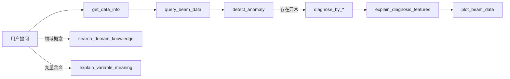

# 束流数据智能分析系统

面向加速器/微电子束流诊断场景的智能分析助手。系统以 **LLM + Function Calling** 为核心，将自然语言问题自动路由到数据查询、异常检测、异常诊断、可视化和知识检索等工具，支持命令行、Web 界面和 OpenClaw Agent 多种使用方式。

## 系统架构

```
用户（自然语言）
       │
       ▼
┌──────────────────────────────────────────┐
│  交互层                                   │
│  main.py（CLI）  app.py（Web）  OpenClaw  │
└──────────────────┬───────────────────────┘
                   │
                   ▼
┌──────────────────────────────────────────┐
│  agents/llm_agent.py                      │
│  BeamDataAgent — LLM 对话 + 工具编排       │
└──────────────────┬───────────────────────┘
                   │ Function Calling
                   ▼
┌──────────────────────────────────────────┐
│  tools/（11 个工具函数）                   │
│  数据查询 │ 异常检测 │ 异常诊断 │ 可视化    │
└──────┬───────────────┬───────────────────┘
       │               │
       ▼               ▼
 data/束流.csv    models/（预训练模型）
                       │
                       ▼
              knowledge/（RAG + 知识图谱）
              ├── vector_store（常规领域知识）
              └── Neo4j generation KG（变量解释）
```

### 典型诊断流程



## 项目结构

```
llm/
├── main.py                 # 命令行交互入口
├── app.py                  # Flask Web 服务
├── config/                 # 配置（API、模型、数据路径）
├── agents/                 # LLM Agent 实现
│   ├── llm_agent.py        # BeamDataAgent / StreamingBeamDataAgent
│   └── tool_logger.py      # 工具调用日志
├── tools/                  # 可被 LLM 调用的工具函数
│   ├── data_query.py       # 数据查询
│   ├── anomaly_detection.py
│   ├── anomaly_diagnose.py # 四种诊断方法
│   └── visualization.py
├── knowledge/              # RAG 与知识图谱
│   ├── parsers/            # PDF/TXT 解析
│   ├── chunkers/           # 文本分块策略
│   ├── retrievers/         # 向量/关键词/混合/KG 检索
│   ├── vector_store/       # FAISS 索引
│   ├── knowledge_graph/    # Neo4j 图谱构建与查询
│   └── rag_tool.py         # 供 Agent 调用的 RAG 工具
├── skills/                 # OpenClaw 技能定义（5 个技能套件）
├── data/                   # 束流数据集与训练样本
│   ├── 束流.csv            # 主数据集
│   └── train_gen/          # 工具调用训练数据生成
├── models/                 # 预训练回归/诊断模型（本地存放）
├── experiment/             # 分块策略与检索效果对比实验
├── scripts/                # 训练数据生成、统计与可视化脚本
├── trail/                  # 效率测试与 OpenClaw 追踪
├── templates/ + static/    # Web 前端
├── output/                 # 图表等运行时输出
└── docs/                   # 对比实验图表等文档
```

## 工具一览

系统共提供 **11 个工具**，按功能分为 5 类（详见 [tools/TOOLS_README.md](tools/TOOLS_README.md)）：

| 分类 | 工具 | 说明 |
|------|------|------|
| 数据查询 | `query_beam_data`, `get_data_info` | 按时间范围查询束流数据、获取元信息 |
| 异常检测 | `detect_anomaly` | 基于回归预测偏差 + 3σ 判据 |
| 异常诊断 | `diagnose_by_statistical_difference`, `diagnose_by_pls`, `diagnose_by_shap`, `diagnose_by_autoencoder` | 四种方法定位异常特征变量 |
| 可视化 | `plot_beam_data` | 绘制束流时序图 |
| 知识检索 | `explain_diagnosis_features`, `explain_variable_meaning`, `search_domain_knowledge` | 知识图谱变量解释 + 常规 RAG |

> RAG 与知识图谱工具依赖 Neo4j 和向量索引，未配置时其余工具仍可正常使用。

## 快速开始

### 1. 环境准备

```bash
# 克隆项目后进入目录
cd llm

# 创建虚拟环境（推荐）
python -m venv venv
# Windows
venv\Scripts\activate
# Linux/macOS
source venv/bin/activate

# 安装依赖
pip install -r requirements.txt

# 可选：知识图谱功能
pip install neo4j jieba
```

### 2. 配置 API

在项目根目录创建 `.env` 文件：

```env
MODELSCOPE_API_KEY=你的API密钥
MODELSCOPE_BASE_URL=https://api-inference.modelscope.cn/v1
MODELSCOPE_LLM_MODEL=Qwen/Qwen3-VL-30B-A3B-Instruct
MODELSCOPE_EMBEDDING_MODEL=Qwen/Qwen3-Embedding-0.6B
```

配置项说明见 [config/config.py](config/config.py)。

### 3. 准备数据与模型

- **束流数据**：将 `束流.csv` 放在 `data/` 目录（配置中默认路径）
- **诊断模型**：将预训练模型文件（`.pkl`、`.pt` 等）放入 `models/`（见 `.gitignore`，需本地获取）
- **知识库（可选）**：
  - 常规 RAG：运行知识库离线索引构建（见 [knowledge/README.md](knowledge/README.md)）
  - 变量解释 KG：启动本地 Neo4j（`bolt://localhost:7687`），使用 `generation` 数据库

## 使用方法

### 命令行交互

```bash
# 标准模式
python main.py

# 流式输出模式
python main.py --stream
```

支持的命令：`help`（帮助）、`reset`（清空对话）、`exit` / `quit`（退出）。

示例问题：
- 「查询 2025 年 8 月 31 日两点到三点的束流数据」
- 「检测该时段是否存在异常」
- 「用 SHAP 方法诊断异常特征」
- 「feature6 是什么意思？」

### Web 界面

```bash
python app.py
```

浏览器访问 [http://localhost:5000](http://localhost:5000)。

主要 API：

| 接口 | 方法 | 说明 |
|------|------|------|
| `/api/chat` | POST | 自然语言对话 |
| `/api/chat/stream` | GET | SSE 流式对话（含工具调用进度） |
| `/api/query` | POST | 直接查询束流数据 |
| `/api/knowledge/search` | POST | 知识库检索 |
| `/api/knowledge/features` | POST | 特征解释 |
| `/api/data/info` | GET | 数据集元信息 |
| `/api/reset` | POST | 重置对话历史 |

### OpenClaw Agent

项目已配置 OpenClaw 技能集，配置文件为 [.openclaw.json](.openclaw.json)。5 个技能模块定义在 [skills/](skills/) 目录，详见 [skills/README.md](skills/README.md)。

```bash
# 在 OpenClaw 中将 workspace 指向本项目根目录即可使用
```

OpenClaw 会话追踪与效率对比工具见 [trail/openclaw/README.md](trail/openclaw/README.md)。

### 直接调用工具（Python）

```python
from tools import TOOL_FUNCTIONS

# 查询数据
result = TOOL_FUNCTIONS["query_beam_data"](
    start_time="2025-08-31 02:00:00",
    end_time="2025-08-31 03:00:00"
)

# 异常检测
result = TOOL_FUNCTIONS["detect_anomaly"](
    start_time="2025-08-31 02:00:00",
    end_time="2025-08-31 03:00:00"
)
```

### 知识库

知识库模块支持文档解析、多种分块策略、FAISS 向量检索和 Neo4j 知识图谱，完整说明见 [knowledge/README.md](knowledge/README.md)。

```python
from knowledge.rag_tool import search_domain_knowledge, explain_variable_meaning

# 领域知识检索（常规 RAG）
search_domain_knowledge("束流不稳定的原因", top_k=3)

# 变量含义查询（generation 知识图谱）
explain_variable_meaning("灯丝电源电流")
```

## 实验与训练数据

### RAG 分块策略对比实验

```bash
python experiment/run_experiment.py
```

对比 fixed / semantic / chapter 等分块策略的检索效果，结果输出到 `experiment/data/` 和 `experiment/plot/`。

### 工具调用训练数据生成

三步流水线脚本，用于生成 LLM 微调用的工具调用样本：

```bash
# 1. 生成问题 + tool_call
python scripts/step1_generate_questions.py

# 2. 执行工具获取 tool_response
python scripts/step2_fetch_tool_responses.py

# 3. 模拟助手回复
python scripts/step3_simulate_assistant.py
```

生成结果保存在 `data/train_gen/`。

### 效率测试

```bash
# 直接调用工具的效率测试
python trail/run_skills_efficiency_test.py

# OpenClaw vs 直接调用对比
python trail/run_openclaw_efficiency_test.py
```

## 子模块文档

各目录均包含 `README.md`，可按需查阅：

| 模块 | 文档 |
|------|------|
| Agent | [agents/README.md](agents/README.md) |
| 配置 | [config/README.md](config/README.md) |
| 数据 | [data/README.md](data/README.md) |
| 工具函数 | [tools/README.md](tools/README.md) |
| 知识库 RAG | [knowledge/README.md](knowledge/README.md) |
| OpenClaw 技能 | [skills/README.md](skills/README.md) |
| 实验 | [experiment/README.md](experiment/README.md) |
| 脚本 | [scripts/README.md](scripts/README.md) |
| 测试追踪 | [trail/README.md](trail/README.md) |
| Web 前端 | [templates/README.md](templates/README.md) + [static/README.md](static/README.md) |
| 文档资源 | [docs/README.md](docs/README.md) |
| OpenClaw 追踪 | [trail/openclaw/README.md](trail/openclaw/README.md) |

## 技术栈

- **LLM**：Qwen 系列（通过 ModelScope OpenAI 兼容 API）
- **Agent**：OpenAI Function Calling + 自定义工具编排
- **数据分析**：pandas、scikit-learn、XGBoost/LightGBM、SHAP
- **知识检索**：FAISS、TF-IDF、Neo4j 知识图谱
- **Web**：Flask + SSE 流式推送
- **可视化**：matplotlib

## 注意事项

1. `.env` 和 `models/` 中的大文件不纳入版本库，需自行配置
2. 知识图谱工具需要本地 Neo4j 服务；未安装时 Agent 仍可完成数据查询、检测、诊断和可视化
3. 异常诊断工具需在确认存在异常后使用，且需提供正常时段与异常时段
4. `plot_beam_data` 仅在用户明确要求可视化时调用，避免不必要的图表生成
