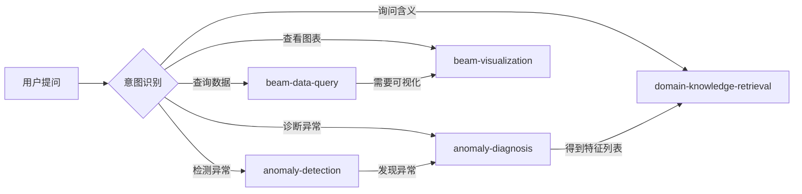

# Beam Diagnostic Agent Skills

## 概述

本目录包含了束流数据分析助手（BeamDataAgent）使用的全部技能定义。这些技能将原有的 11 个工具函数封装成 5 个功能模块化的技能套件，每个技能包含完整的说明书（SKILL.md）和机器可读的配置（skill.json）。

## 技能列表

| 技能名 | 包含工具数 | 功能描述 |
|--------|------------|----------|
| [beam-data-query](./beam-data-query/README.md) | 2 | 束流数据查询和元信息获取 |
| [anomaly-detection](./anomaly-detection/README.md) | 1 | 基于 3σ判据的异常检测 |
| [anomaly-diagnosis](./anomaly-diagnosis/README.md) | 4 | 四种异常特征诊断方法 |
| [beam-visualization](./beam-visualization/README.md) | 1 | 束流时序图绘制 |
| [domain-knowledge-retrieval](./domain-knowledge-retrieval/README.md) | 3 | 知识图谱查询和领域知识检索 |

### 辅助技能（非核心）

| 技能名 | 说明 |
|--------|------|
| [citation-management](./citation-management/README.md) | 学术引用管理（社区技能） |
| [find-skills](./find-skills/README.md) | 技能发现与安装 |
| [skill-security-checker](./skill-security-checker/README.md) | 第三方技能安全审查 |
| [tavily-search](./tavily-search/README.md) | 网络搜索（外部 API） |

**总计**: 5 个技能，11 个工具函数

## 目录结构

```
skills/
├── .openclaw.json                       # OpenClaw 主配置文件
├── README.md                            # 本文件
│
├── beam-data-query/                     # 数据查询技能
│   ├── SKILL.md                         # 技能说明书
│   ├── skill.json                       # 机器可读配置
│   └── reference/
│       └── tool_definitions.json        # 原始工具定义备份
│
├── anomaly-detection/                   # 异常检测技能
│   ├── SKILL.md
│   ├── skill.json
│   └── reference/
│       └── tool_definitions.json
│
├── anomaly-diagnosis/                   # 异常诊断技能
│   ├── SKILL.md
│   ├── skill.json
│   └── reference/
│       └── tool_definitions.json
│
├── beam-visualization/                  # 可视化技能
│   ├── SKILL.md
│   ├── skill.json
│   └── reference/
│       └── tool_definitions.json
│
└── domain-knowledge-retrieval/          # 知识检索技能
    ├── SKILL.md
    ├── skill.json
    └── reference/
        └── tool_definitions.json
```

## 配置文件说明

### .openclaw.json (项目根目录)
OpenClaw 识别 agent 的主配置文件，定义了：
- Agent 基本信息（名称、版本、工作目录）
- 模型配置（默认模型、API 地址）
- 技能列表及对应的文档路径
- 依赖资源路径（数据文件、模型文件、知识库）

### skills/.openclaw.json (技能目录)
技能集的详细配置，包括：
- 每个技能的启用状态
- 每个工具的参数定义和说明
- System prompt 引用建议
- 外部依赖配置

### skills/<name>/skill.json (单个技能)
单个技能的机器可读配置，包含：
- 技能名称、版本、描述
- 工具列表及其参数 Schema
- 文档路径引用

### skills/<name>/SKILL.md (单个技能)
人类可读的技能说明书，包含：
- 功能概述和适用场景
- 工具列表及详细说明
- 参数说明和返回结构
- 使用示例
- 调用时机建议
- 依赖文件和注意事项

## 工作流程建议



典型的诊断流程：
1. **get_data_info** - 了解数据结构
2. **query_beam_data** - 查询特定时间段数据
3. **detect_anomaly** - 判断是否存在异常
4. **diagnose_by_*** - 定位异常原因（任选一种或多种方法对比）
5. **explain_diagnosis_features** - 解释诊断出的特征含义
6. **plot_beam_data** - 可视化结果（可选）

## 集成到现有代码

现有的 `agents/llm_agent.py` 和 `tools/__init__.py` 已经集成了所有工具。

如需更新系统提示词或工具描述，请参考各技能的 SKILL.md 文件。

## 维护说明

- **添加新工具**: 在对应技能的 SKILL.md 和 skill.json 中添加定义，在 `tools/__init__.py` 中注册
- **修改工具描述**: 同时更新 SKILL.md（人类可读）、skill.json（机器可读）、以及原始工具文件中的描述
- **技能文档来源**: 主要文档在工作空间 `C:\Users\jinta\.openclaw\workspace\skills`，通过脚本同步到此目录

## 相关链接

- OpenClaw 文档：https://docs.openclaw.ai
- OpenClaw GitHub: https://github.com/openclaw/openclaw
- Skills Hub: https://clawhub.com
